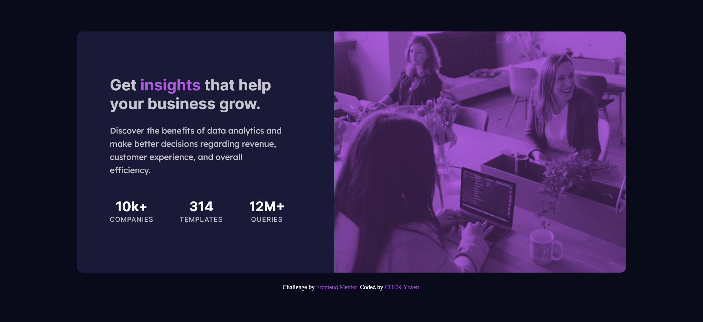
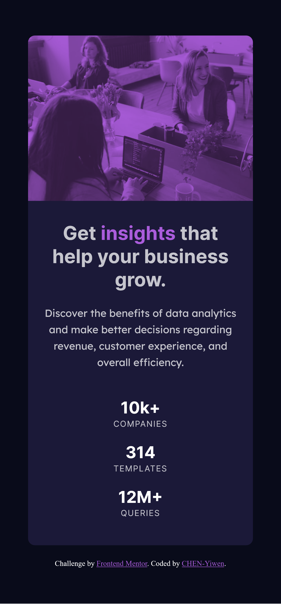

# Frontend Mentor - Stats preview card component solution

This is a solution to the [Stats preview card component challenge on Frontend Mentor](https://www.frontendmentor.io/challenges/stats-preview-card-component-8JqbgoU62). Frontend Mentor challenges help you improve your coding skills by building realistic projects. 

## Table of contents

- [Overview](#overview)
  - [The challenge](#the-challenge)
  - [Screenshot](#screenshot)
  - [Links](#links)
- [My process](#my-process)
  - [Built with](#built-with)
  - [What I learned](#what-i-learned)
  - [Continued development](#continued-development)
  - [Useful resources](#useful-resources)
- [Author](#author)
- [Acknowledgments](#acknowledgments)


## Overview

### The challenge

Users should be able to:

- View the optimal layout depending on their device's screen size

### Screenshot




### Links

- Solution URL: [Add solution URL here](https://your-solution-url.com)
- Live Site URL: [Add live site URL here](https://your-live-site-url.com)

## My process

### Built with

- HTML5
- CSS
- Flexbox

### What I learned

- Again I use <code>display: flex</code> for the layout. I am happy that I am getting used to it. <code>display: flex</code> is useful in changing the layout from column to row when the browser turns into a desktop view. It's my first time using  <code>flex-direction: row-reverse</code>to switch the order of the image and the content.

```css
/*mobile*/
.card{
    width: 100%;
    display: flex;
    flex-direction: column;
}

/*desktop*/
.card{
        flex-direction: row-reverse;
        align-items: center;
    }
```

- I also use <code><picture></code>for the first time. Thanks to @correlucas ' suggestion on my solution to [Product preview card component](https://www.frontendmentor.io/solutions/product-preview-card-component-GIjYF2QvD3), I learn a whole new tag. I find it more intuitive to switch images based on the width of the browser. (However, I am struggling with setting the images to the correct/responsive width😅)
```html
    <picture class="hero-image">
      <source media="(max-width:650px)" srcset="images/image-header-mobile.jpg">
      
    </picture>
```

- I used <code>mix-blend-mode: multiply</code> to create the violet-ish overlay on the top of the image. I like it. It's a rather simple way to achieve a great effect. 

```css
img{
    mix-blend-mode:multiply;
    opacity: 0.7;
}

.hero-image{
    background-color: var(--soft-violet);
}
```
### Continued development
- When I re-szie the browser, some extra spaces will appear around the image. I am still figuring out how to get rid of them.


### Useful resources

- [Stats preview component with HTML & CSS | Frontend Mentor Challenge | Simple Coding Challenge](https://www.youtube.com/watch?v=zaHdmJf_ld4&t=1168s) - In the tutorial, the author use the <code>mix-blend-mode</code> CSS property to blend the image with puprle shade in a easy way. 
- [https://ithelp.ithome.com.tw/articles/10267398](https://ithelp.ithome.com.tw/articles/10267398) - This is agreat article which helped me understand <code>display:flex</code> fast. I will play around with the mentioned properties more so that I can feel more comfortable use them.


## Author

- Frontend Mentor - [@CHEN-YiWen](https://www.frontendmentor.io/profile/CHEN-YiWen)
